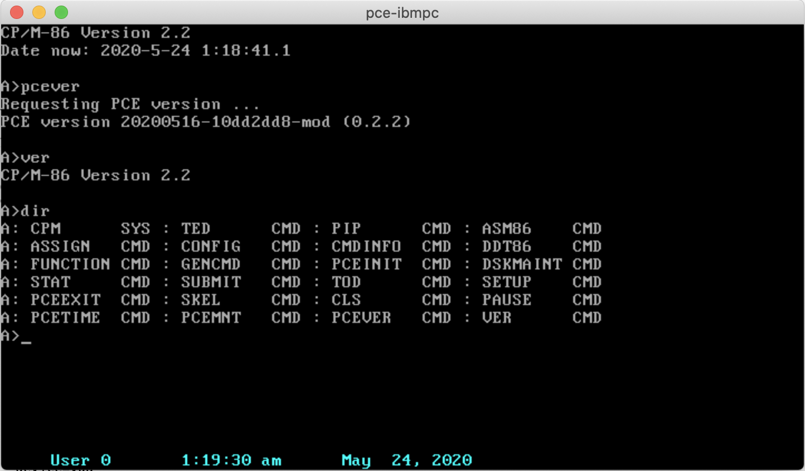
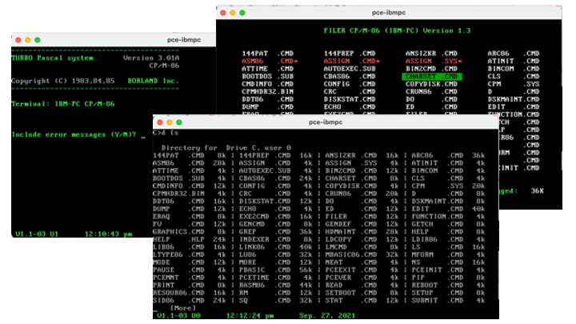

# CP/M-86 Hacking

## Synopsis

A couple of experiments for fun with CP/M-86. The focus is on IBM XT CP/M-86 and derivatives on PC. But most of the tools work with the Just4Fun V20-MBC SBC.

## Where to find CP/M-86?

The source for CP/M-86 doc, sources and binaries is http://www.cpm.z80.de.

A cleaned-up distribution and kernel is available at https://github.com/tsupplis/cpm86-kernel. This distribution is working well in virtual environments, patched with all known patches, 'y2k' friendly (it contains the version of tod which sources are in this project) and AT friendly.

## Tools 

- LS: Directory listing
```
INF: Usage: ls [-h] | [-a] [-p] [-s|-r] [-l|-b] filepat
INF: File listing utility
INF: where filepat is [user/]filespec with wildcard
INF:     -h for help
INF:     -a for all files (including system)
INF:     -p for for pausing one screen at a time
INF:     -s for alphabetic sorting
INF:     -r for reverse alphabetic sorting
INF:     -l for long listing
INF:     -b for basic listing
```
- RM: File delete
```
INF: Usage: rm [-h] | [-a][-i] filepat
INF: File delete utility 
INF: where filepat is [user/]filespec with wildcard
INF:     -h for help
INF:     -a to include both dir and sys files 
INF:     -i for user validation per file 
INF:     -f force file deletion even if read only 
```
- MORE: File content list with pause
```
INF: Usage: more -h | [infile]
INF: File paging utility
INF: where infile is [user/]filespec
INF:     -h for help
```
- WRITE: Equivalent of cat>file
```
INF: Usage: write -h | [-a] filename
INF: File write/create utility
INF: where filename is [user/]filespec
INF:     -h for help
INF:     -a to happen to existing file
```
(Ctrl-C or Ctrl-Z used to finish input)
- DUMP: Hexadecimal dump
```
INF: Usage: dump -h | [-p][-r] [infile]
INF: Hexa file dump utility
INF: where infile is [user/]filespec
INF:     -h for help
INF:     -p pausing every page
INF:     -r raw output
```
- MODE: Screen setup (CP/M-86 1.1 for PC/XT only)
```
INF: Usage: mode -h | option option ...
INF: Console configuration utility
INF:     -h for help
INF: and options:
INF:      cls          Clear screen
INF:      cursor=on    Show cursor
INF:      cursor=off   Hide cursor
INF:      statln=on    Show status line
INF:      statln=off   Hide status line
INF:      status=      Set status line message 
INF:      fg=          Set foreground color (1-F)
INF:      bg=          Set background color (1-F)
```
- TOUCH: Empty file creation
```
INF: Usage: touch [-h] | filespec
INF: Empty file creation utility 
INF:     -h for help
```
- WC: File content counter
```
INF: Usage: wc [-h] | [-a] filepat [filepat] ...
INF: File word/line/character count utility 
INF: where filepat is [user/]filespec with wildcard
INF:     -h for help
INF:     -a to include both dir and sys files 
```
- PRINTENV: Print Environment Variables
```
INF: Usage: printenv [-h]
INF: Display environment variables 
INF:     -h for help
```
For the status, (\\s: space, \\\\: \\, \\u: upper, \\l: lower)
- REBOOT: Simple cold or warm reboot (PC only)
- CLS: Clear screen (clsansi is a vt100/ansi version as opposed to vt52 for PC)
- PAUSE: submit tool waiting for a keystroke
- TOD: Replacement for CP/M-86 without the 78-99 year constraint and date/time validation including leap years. It does not fix the visual issue of the century hard coded to 19. Patches exist for that. It has exactly the same behaviour as the original CP/M-86 tod.cmd tool. (CP/M-86 1.1 for PC/XT only)
- VER: Displays the BDOS version
- MEM: Displays the available and system memory
- BALL: A simple CGA demo (CP/M-86 1.1 for PC/XT, DOS Plus and CCP/M-86 or Concurrent DOS BDOS > 3.1) (take on https://www.z80cpu.eu/mirrors/klaw/bouncy.zip)
- GETCH: A simple keyboard scanner
- AT clock tools
    - ATTIME: Sync up clock (PC/XT with an AT compatible clock only)
    - ATINIT: Sync up clock and display boot banner (PC/XT with an AT compatible clock only)
- PCE tools (PCE Emulator only)
    - PCETIME: Sync up clock
    - PCEINIT: Sync up clock and display boot banner 
    - PCEVER: Displays the Emulator version 
    - PCEEXIT: Leaves the Emulator
    - PCEMNT: Mount a disk image from the host

ATINIT and PCEINIT tools provide a quick configuration dump equivalent to what CP/M-86 1.1 displays on boot

```
CP/M-86 1.1, BDO 2.2
Hardware Configuration: 
 - System Memory: 640Kb
 - Available Memory: 607Kb
 - Math Coprocessor: No
 - Floppy Drive(s): 2
 - Hard Disk(s): 1
 - Parallel Port(s): 1
 - Serial Port(s): 2
Date now: 2021-9-27 22:17:39.0
```

All the C tools (rm, ls, mode, more, write, dump) benefit from the file specification pattern of Aztec C: [user]/[drive]:[filespec]. as well basic \<file and \>file redirects are supported.

## What CP/M-86?

Unless mentioned otherwise, all the tools are working on 
- CP/M-86 1.1 
- DOS Plus 1.2
- Personal CP/M 2.04
- Concurrent DOS 3.2, DOS 4.1 6.21

For the following OSes, only the files tools work well. Interacting with the bios is generally prohibited (ATINIT/ATTIME and PCEINIT/PCETIME)...
- Concurrent CP/M 3.0
- Concurrent CP/M 3.1

Those OSes work incredibly well on PCE on floppy and HD images. This emulator is simple, small and works a treat. Fantastic...





## PCE tools shortcuts

- pcetime has no option, It displays and sets up the clock using
    - BDOS Function 68h (T_SET) if BDOS >= 3.0 (Dates from 01/01/1978)
    - Using System Variable Control Block through BDOS Function 31h (S_SYSVAR) on BDOS= 2.2
- pcemnt needs to accomodate CCP uppercasing so an toggle character '^' is used to this effect:
    - /Mnt^/User/^JOhn/^test.img becomes /mnt/USERS/john/TEST.IMG

## Build Environment
- Makefile for DOS Aztec C cross compilers targetting CP/M-86.  (May require adaptation. emu2 is used to run dos compiler on unix/mac)
- aztec c compiler version 3.4
- rasm86/linkcmd, DOS version from Digital Research (http://www.cpm.z80.de/binary.html)

```
LINK86 Linkage Editor  02/Feb/87      Version 2.02
Cross Linker: DOS -> CPM-86 & CDOS-286      1/2/86
```
```
RASM-86 Assembler   12-Mar-87  PC-DOS Version 1.4a
```
- The Super Cool emu2 DOS emulator to run the DR tools on macOS and Linux (https://github.com/dmsc/emu2). This is an incredible way to bring dos command line development tools to a modern and up to date shell/make/whatever based dev environment. Another stunning emulator. Emu2 and PCE are an incredible pair.

For a rudimentary, cross development environment, look at (https://github.com/tsupplis/cpm86-crossdev).

Some submit/batch scripts are provided for dos (aztec 3.4) and cp/m-86 (aztec 3.2) are also available.

## Test Environment
- CP/M-86 1.1 for IBM PC XT patched at https://github.com/tsupplis/cpm86-kernel
  - CP/M-86 1.1, CCP/M-86 3.1 and PCP/M-2.0 can be found on (http://www.cpm.z80.de)
  - DOS Plus 1.2 and Patched kernel can be found on (https://www.seasip.info/Cpm/dosplus.html)
- The Excellent PCE emulator (http://www.hampa.ch/pce/pce-ibmpc.html)
- mtools 4 and cpmtools 2.20

## Quick points on CP/M-86
Despite being a very primitive OS (in some cases actually enjoyably primitive...No time management at all outside of the clock, for example), it is possible to do quite an amount of things with a couple of good tools:
- DR CB86 2.0 (http://www.cpm.z80.de/binary.html)
- DR C86 1.11 (http://www.cpm.z80.de/binary.html)
- Aztec C 3.2 (Although Aztec C 3.4 or C 4.10 (ANSI) cross compilation from DOS is better) (https://www.aztecmuseum.ca/compilers.htm)
- Turbo Pascal 3.01A and Poly Pascal 3.1 (Turbo Pascal Sibling)
- RASM86 Macro Assembler (http://www.cpm.z80.de/binary.html)
- Microsoft Basic (http://www.retroarchive.org/cpm/lang/lang.htm) and Personal Basic Interpreters (http://www.cpm.z80.de/binary.html)
- PL/M-86 (Only cross compilation from DOS)

The big cool thing with this tiny OS is how small it is. I never configure more than 128K on my PCE VM and a single person can play as a hobbyist with it. As mention earlier it works also super well with the Just4Fun V20-MBC SBC (https://hackaday.io/project/170924-v20-mbc-a-v20-8088-8080-cpu-homebrew-computer). Cool other thing: it is Y2K compliant with TOD replacement above and a small visual hack. Yep no date management ...

It makes The early sources of MS-DOS as attractive. MS-DOS 2.X is far more flexible and has a bigger ecosystem than CP/M-86. This makes it more of a challenge ;-) 

DR tools are available through (http://www.cpm.z80.de/binary.html) and many other sources.
I found the last release of Turbo Pascal and Poly Pascal on a very exhaustive danish site focused on the RC700 series computers who are by the way also emulated by PCE. They are not PC compatible but both pascal are generic and work on the IBM PC based CP/M-86 family.
- (https://rc700.dk/software.php?name=RC750_TurboPascal_v3.01a)
- (https://rc700.dk/software.php?name=RC759_PolyPascal_v3.1) 

But the files need to be extracted from disk images using cpmtools using the following definition:

```
diskdef rc75x
  seclen 1024
  tracks 154
  sectrk 8
  blocksize 2048
  maxdir 512
  boottrk 4
  os 3
end
```

Turbo Pascal 3.01A is the last releasse on CP/M-86 (Don't forget to configure it using
tinst) and is in english. Poly pascal is also in english but the message file and the online help are in Danish. Not a big deal to translate them. Poly Pascal is really a twin, sibling or ancestor of Turbo Pascal. Kinda cool to play with it.

Macro assembler, C, Pascal, Structure Basic ... what else do we need?

Cross Compilation can be done either using DOS emulation (emu2, pce) or using a hybrid OS
- DOS Plus 1.2
- Concurrent DOS 6.21 XM

... run all the tools above (Both in their DOS and CP/M version) and you can test directly the cmd binaries.

A few CP/M-86 emulators for DOS exist (ame86.exe, cpm86.exe) unfortunately their sources
are not to be seen anywhere and they woulld need a bit of maintenance. only rudimentary
programs work.

Finally, Assembly using asm86 and gencmd can also be done but it needs to be done on CP/M environments (CP/M-80 or CPM-86 derivatives can be used)

It is a bit lacking on the tooling side though ... so I will port tools little by little for comfort sake.
- VE+ 2.03 (or better VE+ 2.33a) is really the only strong editor I found. (http://www.retroarchive.org/cpm/text/text.htm) (There is also TED a basic editor that allows you to stay away from ED). 
- Automation through submit is very very rudimentary (no dream of makefiles)
- There is no real solid CP/M-86 emulation as mentioned... But piggy backing the INT E0H API end point on emu2 perhaps? after all the 2 CP/M-86 and DOS 1.1 APIs are pretty much aligned...

Still it is a funny bit of discovery and archeology...
