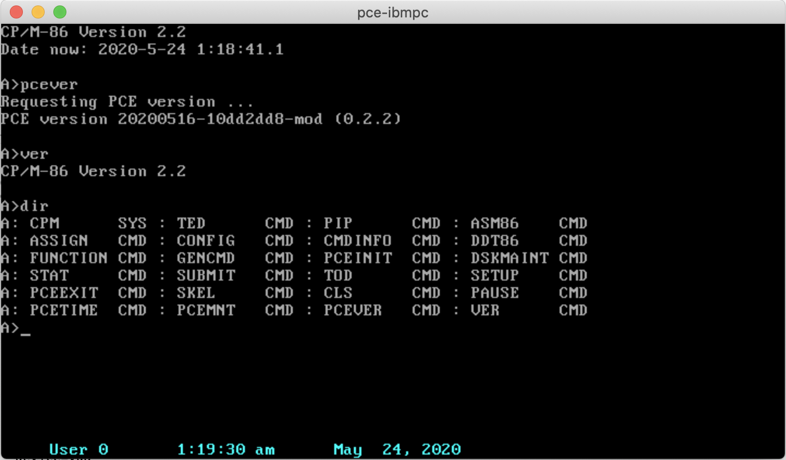
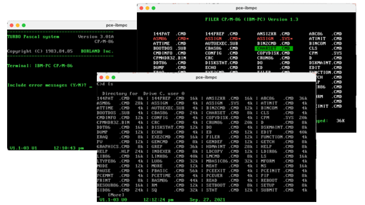

# CP/M-86 Hacking

## Synopsis

A couple of experiments for fun with CP/M-86. The focus is on IBM XT CP/M-86 and derivatives on PC. But most of the tools work with the Just4Fun V20-MBC SBC.



## Where to find CP/M-86?

The source for CP/M-86 doc, sources and binaries is http://www.cpm.z80.de.

A cleaned-up distribution and kernel is available at https://github.com/tsupplis/cpm86-kernel. This distribution is working well in virtual environments, patched with all known patches, 'y2k' friendly (it contains the version of tod which sources are in this project) and AT friendly.

## Tools

### File and Console Tools

| Tool | Purpose | Usage and options |
| --- | --- | --- |
| `ls` | Directory listing | `ls [-h] \| [-a] [-p] [-s\|-r] [-l\|-b] filepat`<br>`filepat` is `[user/]filespec` with wildcards. `-a` includes system files, `-p` pauses, `-s`/`-r` sort, and `-l`/`-b` select long/basic output. |
| `rm` | File deletion | `rm [-h] \| [-a][-i] filepat`<br>`-a` includes directory and system files, `-i` asks for confirmation, and `-f` deletes read-only files. |
| `more` | Paginated file display | `more -h \| [infile]`<br>`infile` is a `[user/]filespec`. |
| `copycon` | Copy console input to a file | `copycon -h \| [-a] filename`<br>`filename` is a `[user/]filespec`; `-a` appends. Ctrl-C or Ctrl-Z finishes input. |
| `dump` | Hexadecimal dump | `dump -h \| [-p][-r] [infile]`<br>`-p` pauses each page and `-r` selects raw output. |
| `mode` | Screen configuration | `mode -h \| option option ...`<br>Supports `cls`, `cursor=on/off`, `statln=on/off`, `status=`, `fg=`, and `bg=`. CP/M-86 1.1 for PC/XT only. |
| `touch` | Empty file creation | `touch [-h] \| filespec` |
| `wc` | Count file contents | `wc [-h] \| [-a] filepat [filepat] ...`<br>Counts words, lines, and characters. `-a` includes directory and system files. |
| `printenv` | Display environment variables | `printenv [-h]`<br>Status text supports `\\s` for space, `\\` for backslash, `\\u` for upper case, and `\\l` for lower case. |

### System and Demo Tools

| Tool | Purpose | Compatibility or build note |
| --- | --- | --- |
| `reboot` | Cold or warm reboot | PC only. |
| `cls` | Clear the screen | `cls` targets VT52; `clsansi` targets VT100/ANSI terminals. |
| `pause` | Wait for a keystroke | CP/M-86 submit tool. |
| `wait` | Wait for n seconds | CP/M-86 submit tool. |
| `tod` | Replacement date/time utility | Removes the 78-99 year constraint and validates dates, including leap years. CP/M-86 1.1 for PC/XT only. |
| `ver` | Display BDOS version | `dosver.com` is the DOS counterpart for PC-MODE systems. |
| `mem` | Display available and system memory | `dosmem.com` and `dosmem11.com` are the DOS counterparts. |
| `ball` | CGA bouncing-ball demo | CP/M-86 assembly source in `ball.a86`; built with `asm86`, then `gencmd 8080`. Supported on CP/M-86 1.1 PC/XT, DOS Plus, and CCP/M-86 or Concurrent DOS with BDOS > 3.1. Based on https://www.z80cpu.eu/mirrors/klaw/bouncy.zip. |
| `ballc` | CGA bouncing-ball demo | C implementation of the same demo. |
| `getch` | Keyboard scanner | `dosgetch.com` is the DOS counterpart. |
| `zpdump` | Dump the zero page | `pspdump.com` is the DOS counterpart and supports `-c` to call DOS `int 21h` function `26h` before dumping the new PSP. |

### Clock and Emulator Tools

| Group | Tools | Purpose and compatibility |
| --- | --- | --- |
| AT clock | `attime`, `atinit` | Synchronize the clock; `atinit` also displays a boot banner. PC/XT with an AT-compatible clock only. |
| RTC clock | `rtctime`, `rtcinit` | Synchronize the clock; `rtcinit` also displays a boot banner. Dallas clock at port `02C0h` by default. |
| PCE emulator | `pcetime`, `pceinit`, `pcever`, `pceexit`, `pcemnt` | Clock setup, boot banner, emulator version, emulator exit, and host disk-image mounting. PCE only. |

`atinit`, `rtcinit` and `pceinit` provide a quick configuration dump equivalent to what CP/M-86 1.1 displays on boot

```
CP/M-86 1.1, BDO 2.2
Hardware Configuration: 
 - System Memory: 640Kb
 - Available Memory: 607Kb
 - Math Coprocessor: No
 - Floppy Drive(s): 2
 - Hard Disk(s): 1
 - Parallel Port(s): 1
 - Serial Port(s): 2
Date now: 2021-9-27 22:17:39.0
```

All the C tools (rm, ls, mode, more, copycon, dump) benefit from the file specification pattern of Aztec C: [user]/[drive]:[filespec]. as well basic \<file and \>file redirects are supported.

## What CP/M-86?

Unless mentioned otherwise, all the tools are working on 
- CP/M-86 1.1 
- DOS Plus 1.2
- Personal CP/M 2.04
- Concurrent DOS 3.2, DOS 4.1 6.21

For the following OSes, only the files tools work well. Interacting with the bios is generally prohibited (ATINIT/ATTIME and PCEINIT/PCETIME)...
- Concurrent CP/M 3.0
- Concurrent CP/M 3.1

Those OSes work incredibly well on PCE on floppy and HD images. This emulator is simple, small and works a treat. Fantastic...




## PCE tools shortcuts

- pcetime has no option, It displays and sets up the clock using
    - BDOS Function 68h (T_SET) if BDOS >= 3.0 (Dates from 01/01/1978)
    - Using System Variable Control Block through BDOS Function 31h (S_SYSVAR) on BDOS= 2.2
- pcemnt needs to accomodate CCP uppercasing so an toggle character '^' is used to this effect:
    - /Mnt^/User/^JOhn/^test.img becomes /mnt/USERS/john/TEST.IMG

## Build Environment

For this cross development environment, please use (https://github.com/tsupplis/cpm86-crossdev). It comes with wrappers for all the tools necesary.


## Test Environment

- CP/M-86 1.1 for IBM PC XT patched at https://github.com/tsupplis/cpm86-kernel
  - CP/M-86 1.1, CCP/M-86 3.1 and PCP/M-2.0 can be found on (http://www.cpm.z80.de)
  - DOS Plus 1.2 and Patched kernel can be found on (https://www.seasip.info/Cpm/dosplus.html)
- The Excellent PCE emulator (http://www.hampa.ch/pce/pce-ibmpc.html)
- The most excellent CLI emulator for DOS and CP/M-86 is available at https://github.com/johnsonjh/emu2-cpm86 and delivered as part of the crossdev project.
- mtools 4 and cpmtools 2.20

## Quick points on CP/M-86

Despite being a very primitive OS (in some cases actually enjoyably primitive...No time management at all outside of the clock, for example), it is possible to do quite an amount of things with a couple of good tools:
- DR CB86 2.0 (http://www.cpm.z80.de/binary.html)
- DR C86 1.11 (http://www.cpm.z80.de/binary.html)
- Aztec C 3.2 (Although Aztec C 3.4 or C 4.10 (ANSI) cross compilation from DOS is better) (https://www.aztecmuseum.ca/compilers.htm)
- Turbo Pascal 3.01A and Poly Pascal 3.1 (Turbo Pascal Sibling)
- RASM86 Macro Assembler (http://www.cpm.z80.de/binary.html)
- Microsoft Basic (http://www.retroarchive.org/cpm/lang/lang.htm) and Personal Basic Interpreters (http://www.cpm.z80.de/binary.html)
- PL/M-86 (Only cross compilation from DOS)

The big cool thing with this tiny OS is how small it is. I never configure more than 128K on my PCE VM and a single person can play as a hobbyist with it. As mention earlier it works also super well with the Just4Fun V20-MBC SBC (https://hackaday.io/project/170924-v20-mbc-a-v20-8088-8080-cpu-homebrew-computer). Cool other thing: it is Y2K compliant with TOD replacement above and a small visual hack. Yep no date management ...

It makes The early sources of MS-DOS as attractive. MS-DOS 2.X is far more flexible and has a bigger ecosystem than CP/M-86. This makes it more of a challenge ;-) 

DR tools are available through (http://www.cpm.z80.de/binary.html) and many other sources.
I found the last release of Turbo Pascal and Poly Pascal on a very exhaustive danish site focused on the RC700 series computers who are by the way also emulated by PCE. They are not PC compatible but both pascal are generic and work on the IBM PC based CP/M-86 family.
- (https://rc700.dk/software.php?name=RC750_TurboPascal_v3.01a)
- (https://rc700.dk/software.php?name=RC759_PolyPascal_v3.1) 

But the files need to be extracted from disk images using cpmtools using the following definition:

```
diskdef rc75x
  seclen 1024
  tracks 154
  sectrk 8
  blocksize 2048
  maxdir 512
  boottrk 4
  os 3
end
```

Turbo Pascal 3.01A is the last releasse on CP/M-86 (Don't forget to configure it using
tinst) and is in english. Poly pascal is also in english but the message file and the online help are in Danish. Not a big deal to translate them. Poly Pascal is really a twin, sibling or ancestor of Turbo Pascal. Kinda cool to play with it.

Macro assembler, C, Pascal, Structure Basic ... what else do we need?

Cross Compilation can be done either using DOS emulation (emu2, pce) or using a hybrid OS
- DOS Plus 1.2
- Concurrent DOS 6.21 XM

... run all the tools above (Both in their DOS and CP/M version) and you can test directly the cmd binaries.

A few CP/M-86 emulators for DOS exist (ame86.exe, cpm86.exe) unfortunately their sources
are not to be seen anywhere and they woulld need a bit of maintenance. only rudimentary
programs work.

Finally, Assembly using asm86 and gencmd can also be done but it needs to be done on CP/M environments (CP/M-80 or CPM-86 derivatives can be used)

It is a bit lacking on the tooling side though ... so I will port tools little by little for comfort sake.
- VE+ 2.03 (or better VE+ 2.33a) is really the only strong editor I found. (https://github.com/johnsonjh/vedit) 
- A VI like editor is available for CP/M-86 at https://github.com/tsupplis/cpm86-vi
- There is no real solid CP/M-86 emulation as mentioned... But piggy backing the INT E0H API end point on emu2 perhaps? after all the 2 CP/M-86 and DOS 1.1 APIs are pretty much aligned...

Still it is a funny bit of discovery and archeology...

--

## Companion projects

| Project | Description |
|---------|-------------|
| [cpm86-kernel](https://github.com/tsupplis/cpm86-kernel)     | CP/M-86 1.1 distribution rebuilt from patched and reconstituted sources |
| [ccpm86-y2k](https://github.com/tsupplis/ccpm86-y2k)         | CCP/M-86 3.1 distribution rebuilt from patched and reconstituted sources |
| [cpm86-crossdev](https://github.com/tsupplis/cpm86-crossdev) | Unix CP/M-86 cross development project (compilers, emulation and tools) |
| [cpm86-hacking](https://github.com/tsupplis/cpm86-hacking)   | CP/M-86 miscellaneous tools and PCE emulator helpers |
| [cpm86-cmdtools](https://github.com/tsupplis/cpm86-cmdtools) | CP/M-86 `.cmd` file manipulation tools |
| [cpm86-ports](https://github.com/tsupplis/cpm86-ports)       | CP/M-86 application ports in C and assembler |
| [cpm86-vi](https://github.com/tsupplis/cpm86-vi)             | STevie vi port for CP/M-86 and PC-DOS 1.1 |
| [pcdos11-hacking](https://github.com/tsupplis/pcdos11-hacking) | PC-DOS 1.1 distribution, tools and notes |
