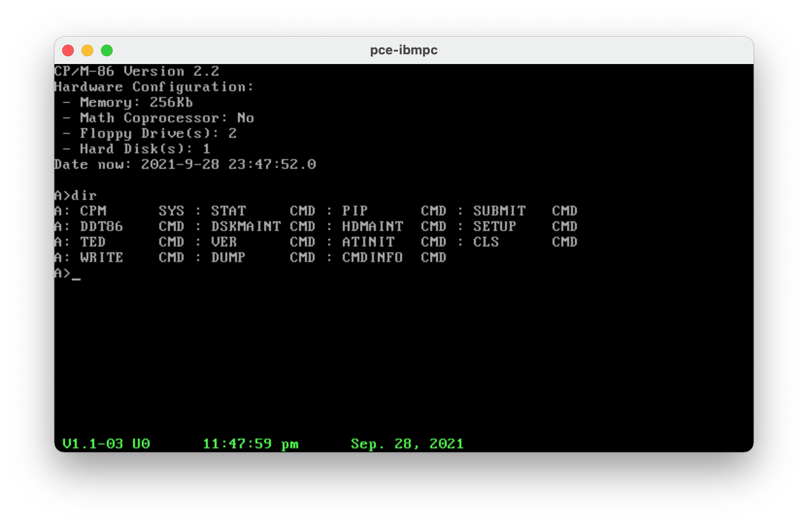

# CP/M-86 hacking

A couple of experiments for fun with CP/M-86 including a quick and dirty port of
pce emulator tools to CP/M-86 
- pcetime
- pceexit
- pcever
- pcemnt
- pceinit (a combination of clear screen pcetime and pcever as CP/M-86
  start up command

All the tools are working on 
- CP/M-86 1.1
- Concurrent CP/M 3.1
- Concurrent DOS 3.2 to 6.21
- Personal CP/M 2.04
- DOS Plus 1.2

Those OSes work Incredibly well on PCE on floppy and HD images. This emulator is simple, small and works a treat. Fantastic...




## Tools used
- CP/M-86 1.1 for IBM PC XT. I recompile cpm.sys from patched sources from (http://www.cpm.z80.de/source.html)
  - CP/M-86 1.1, CCP/M-86 3.1 and PCP/M-2.0 can be found on (http://www.cpm.z80.de)
  - DOS Plus 1.2 and Patched kernel can be found on (https://www.seasip.info/Cpm/dosplus.html)
- The Excellent PCE emulator (http://www.hampa.ch/pce/pce-ibmpc.html)
- rasm86/linkcmd, DOS version from Digital Research (http://www.cpm.z80.de/binary.html)
```
LINK86 Linkage Editor  02/Feb/87      Version 2.02
Cross Linker: DOS -> CPM-86 & CDOS-286      1/2/86
```
```
RASM-86 Assembler   12-Mar-87  PC-DOS Version 1.4a
```
- The Super Cool emu2 DOS emulator to run the DR tools on macOS and Linux (https://github.com/dmsc/emu2). This is an incredible way to bring dos command line development tools to a modern and up to date shell/make/whatever based dev environment. Another stunning emulator. Emu2 and PCE are an incredible pair.
- mtools 4 and cpmtools 2.20

There is of course the painful case of CP/M-86 only tools like gencmd and asm86. Till I find the sources and try to build DOS versions for cross compilation, I am using the same technique but with zxcc thar provides a transparent shell integrated CP/M-80 3.1 emulation. ZXCC can be found on his author web site (https://www.seasip.info/Unix/Zxcc/). ASM86 and GENCMD are both available as CP/M .COM binaries. This side is by the way one of the best sources of information on CP/M. ZXCC initially focused on being a wrapper for Hitech-C is working faultlessly on all the dev tools I threw at it.

## PCE tools shortcuts
- pcetime has no option, It displays and sets up the clock using
    - BDOS Function 68h (T_SET) if BDOS >= 3.0 (Dates from 01/01/1978)
    - Using System Variable Control Block through BDOS Function 31h (S_SYSVAR) on BDOS= 2.2
- pcemnt needs to accomodate CCP uppercasing so an toggle character '^' is used to this effect:
    - /Mnt^/User/^JOhn/^test.img becomes /mnt/USERS/john/TEST.IMG

## To dos
- build a full end to end functioning CP/M-86 dev environmet.
- pcetime to adjust seconds on BDOS >=3.0? T_SET resets the seconds to 0 on invokation
- move to microsoft/IBM MIT licensed link & masm tools
- provide DOS batch and CP/M submit for the build
- add a TOD replacement for CP/M-86
- study recompilation and patch of Date, Show and Dir and in the meantime regress test
- a clean reusable makefile
  CDOS 4.1 tools utilities on CCPM-86 2.0/CDOS 3.2
- clean up code duplicates
- more tools/experiments
- sort out why cpmtools refuses to work with 320kb (for testing I use single face 160K
  images). ibmpc-514ds does not seem to work
- explore further CP/M-86 Big Brothers (PCP/M 2.04 and CCP/M 3.1). At first glance, they
are giving you better CP/M-Plus like experience than the rough CP/M 2.2 interface of CP/M-86 but CCP/M-86 has a lot of quirks and PCP/M Keyboard configuration is a bit tricky (Fully IBM PC compatible?) .... to be explored
- deliver a guide to rebuild CP/M-86 from its sources with all the patches, AT support and 2020 look and feel. It works well but publishing the fixes and the code may not be allowed. all sources of information and code to start were found on (http://www.cpm.z80.de/source.html). It just required a lot of effort to compare/consolidate code, annotations, patches and comparison with existing binary versions. A lot of fun.
- try to pull/port a version of Emacs or VI on CP/M-86. I could not find one....

## Quick points on CP/M-86
Despite being a very primitive OS (in some cases actually enjoyably primitive...No time management at all outside of the clock, for example), it is possible to do quite an amount of things with a couple of good tools:
- DR CB86 2.0 (http://www.cpm.z80.de/binary.html)
- DR C86 1.32 (http://www.cpm.z80.de/binary.html)
- Aztec C 3.2 (Although Aztec C 4.10 (ANSI) cross compilation from DOS is better) (https://www.aztecmuseum.ca/compilers.htm)
- Turbo Pascal 3.01A and Poly Pascal 3.1 (Turbo Pascal Sibling)
- RASM86 Macro Assembler (http://www.cpm.z80.de/binary.html)
- Microsoft Basic (http://www.retroarchive.org/cpm/lang/lang.htm) and Personal Basic Interpreters (http://www.cpm.z80.de/binary.html)
- PL/M-86 (Only cross compilation from DOS)

The big cool thing with this tiny OS is how small it is. A single person can play as a hobbyist with it. It makes The early sources of MS-DOS as attractive. MS-DOS 2.X is far more flexible and has a bigger ecosystem than CP/M-86. This makes it more of a challenge ;-) 

DR tools are available through (http://www.cpm.z80.de/binary.html) and many other sources.
I found the last release of Turbo Pascal and Poly Pascal on a very exhaustive danish site focused on the RC700 series computers who are by the way also emulated by PCE. They are not PC compatible but both pascal are generic and work on the IBM PC based CP/M-86 family.
- (https://rc700.dk/software.php?name=RC750_TurboPascal_v3.01a)
- (https://rc700.dk/software.php?name=RC759_PolyPascal_v3.1) 

But the files need to be extracted from disk images using cpmtools using the following definition:

```
diskdef rc75x
  seclen 1024
  tracks 154
  sectrk 8
  blocksize 2048
  maxdir 512
  boottrk 4
  os 3
end
```

Turbo Pascal 3.01A is the last releasse on CP/M-86 (Don't forget to configure it using
tinst) and is in english. Poly pascal is also in english but the message file and the online help are in Danish. Not a big deal to translate them. Poly Pascal is really a twin, sibling or ancestor of Turbo Pascal. Kinda cool to play with it.

Macro assembler, C, Pascal, Structure Basic ... what else do we need?

Cross Compilation can be done either using DOS emulation (emu2, pce) or using a hybrid OS
- Concurrent DOS 6.21 XM
- DOS Plus 1.2

... run all the tools above (Both in their DOS and CP/M version) and you can test directly the cmd binaries.

A few CP/M-86 emulators for DOS exist (ame86.exe, cpm86.exe) unfortunately their sources
are not to be seen anywhere and they woulld need a bit of maintenance. only rudimentary
programs work.

Finally, Assembly using asm86 and gencmd can also be done but it needs to be done on CP/M environments (CP/M-80 or CPM-86 derivatives can be used)

It is a bit lacking on the tooling side though
- VE+ 2.03 is really the only strong editor I found. (http://www.retroarchive.org/cpm/text/text.htm) (There is also TED a basic editor that allows you to stay away from ED). 
- Automation through submit is very very rudimentary (no dream of makefiles)
- There is no real solid CP/M-86 emulation as mentioned... But piggy backing the INT E0H API end point on emu2 perhaps? after all the 2 CP/M-86 and DOS 1.1 APIs are pretty much aligned...

Still it is a funny bit of discovery and archeology
